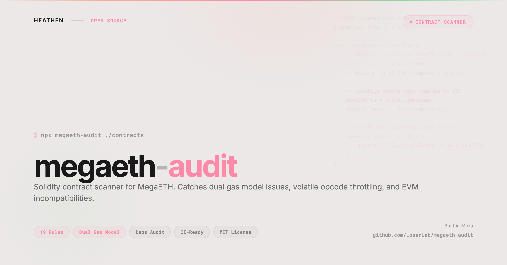

# megaeth-audit

<p align="center">
  
</p>

Solidity contract and project scanner for [MegaETH](https://megaeth.systems). Catches dual gas model issues, volatile opcode throttling, EVM incompatibilities, and deprecated dependencies before deployment.

## Install

```bash
npx megaeth-audit
```

Or install globally:

```bash
npm install -g megaeth-audit
megaeth-audit
```

## Usage

```bash
# Scan current directory
megaeth-audit

# Scan a specific project
megaeth-audit ./my-contracts

# JSON output (for CI/CD)
megaeth-audit --json

# Only show high+ severity
megaeth-audit --severity high
```

## Rules

### Solidity Rules

| ID | Severity | Description |
|----|----------|-------------|
| MGA001 | Critical | Hardcoded 21000 gas is insufficient (dual gas model, minimum 60,000) |
| MGA002 | High | Volatile opcode caps remaining compute gas to 20M |
| MGA003 | High | 98/100 gas forwarding, not Ethereum's 63/64 |
| MGA004 | High | selfdestruct only works in creation transaction (EIP-6780) |
| MGA005 | High | Hardcoded block counts assume 12s (MegaETH is ~1s) |
| MGA006 | High | prevrandao not reliable (centralized sequencer) |
| MGA007 | High | block.coinbase is sequencer address |
| MGA008 | High | Blob opcodes not supported (EigenDA, not EIP-4844) |
| MGA009 | Moderate | gasleft() only reflects compute gas, not storage gas |
| MGA010 | Moderate | block.difficulty maps to prevrandao |
| MGA011 | Info | Verify EVM version compatibility (Prague-based, 512 KB contracts) |

### Dependency Rules

| ID | Severity | Description |
|----|----------|-------------|
| DEP001 | High | ethers v5 is end-of-life |
| DEP002 | High | web3.js < 4.0 is deprecated |
| DEP003 | High | Truffle is sunset |
| DEP004 | High | Ganache is sunset |
| DEP005 | Moderate | @openzeppelin/contracts < 5.0 is outdated |
| DEP006 | Moderate | @arbitrum/sdk irrelevant for MegaETH |
| DEP007 | Moderate | Foundry simulation won't account for storage gas |
| DEP008 | Info | Consider MegaETH RPC for gas estimation |

## Exit Codes

- `0` - No issues (or info only)
- `1` - High or moderate issues found
- `2` - Critical issues found

## Programmatic API

```typescript
import { scan, formatHuman, formatJson } from "megaeth-audit";

const result = scan("./my-contracts");
console.log(formatHuman(result));
```

## Part of the MegaETH Developer Toolkit

| Tool | What it does |
|------|-------------|
| **megaeth-audit** (this tool) | Catch dual gas model issues, volatile opcode throttling, and EVM incompatibilities in your Solidity contracts |
| [megaeth-gas](https://github.com/LoserLab/megaeth-gas) | Estimate gas costs on MegaETH vs Ethereum |

## License

MIT
